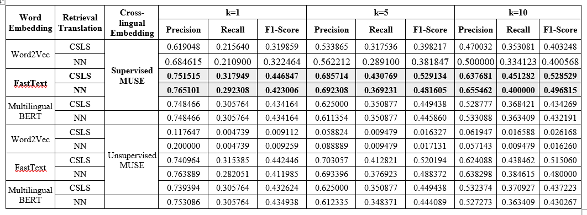

<p align="center">
  <h2 align="center">Monolingual Mapping</h2>
  <h3 align="center">Javanese and Sundanese Dictionary</h3>
</p>

## Model Description
First, monolingual mapping learns word vector representation from each monolingual corpus. Then, it learns transformation matrix that performs monolingual mapping from the source languages word embedding to the target languages. In this work, we used MUSE library to implement this approach. You can find the detail information about MUSE [here](https://github.com/facebookresearch/MUSE).

## Architecture Design
<p align="center">
    
</p>

1. The Javanese and Sundanese corpus preprocessed. The preprocessing process consist of deleting English words and sentence windowing. 
2. Then, for each corpus, monolingual word embedding generated using pre-trained model FastText, Word2Vec, and feature extraction on pre-trained multilingual BERT model. 
3. After that, the Javanese word embedding mapped to Sundanese embedding space to creates cross-lingual representation of Javanese words toward Sundanese. The monolingual mapping used supervised and unsupervised MUSE. 
4. Last, from the cross-lingual representation, pair translation retrieved using nearest-neighbor and cross-domain local scaling method.
## Experiment Result

<p align="center">
    
</p>

- The model with supervised or unsupervised MUSE that used pre-trained FastText and feature extraction on pre-trained Multilingual BERT achieved higher performance than the model used Word2Vec.
- All model with supervised MUSE achieved higher performances than the unsupervised MUSE model.
- Model Supervised MUSE – FastText achieved highest performance. The model achieved f1-score NN value 0.4230 and f1-score CSLS value 0.4468.

## How to use?
### 1. Data Preparation
Prepare word embedding of Javanese and Sundanese. For Word2Vec and feature extraction BERT, you can use our code from [here](https://github.com/sekarlm/Pseudo-Bilingual-Corpora). For FastText, you can use Javanese and Sundanese pre-trained word embedding from [here](https://fasttext.cc/docs/en/pretrained-vectors.html).
### 2. Monolingual Mapping, Translation Retrieval, and Evaluation
Mapping Javanese embedding to Sundanese embedding using supervised MUSE and unsupervised MUSE. We have made some changes to the MUSE original code. Here is the changes.
- Solved deprecated code
- Added script to write the translation pairs into a file
- Added recall and f1-score calculation as evaliation metrics

**Supervised MUSE**
```
python3 supervised.py --src_lang jv --tgt_lang su --src_emb data/vectors/jv.ft.txt --tgt_emb data/vectors/su.ft.txt --n_refinement 5 --dico_train data/crosslingual/dictionaries/jv-su-train.txt --dico_eval data/crosslingual/dictionaries/jv-su-test.txt

```

**Unsupervised MUSE**
```
python3 unsupervised.py --src_lang jv --tgt_lang su --src_emb data/vectors/jv.ft.txt --tgt_emb data/vectors/su.ft.txt --n_refinement 5 --n_epochs 5 --dico_eval data/crosslingual/dictionaries/jv-su-test.txt

```
